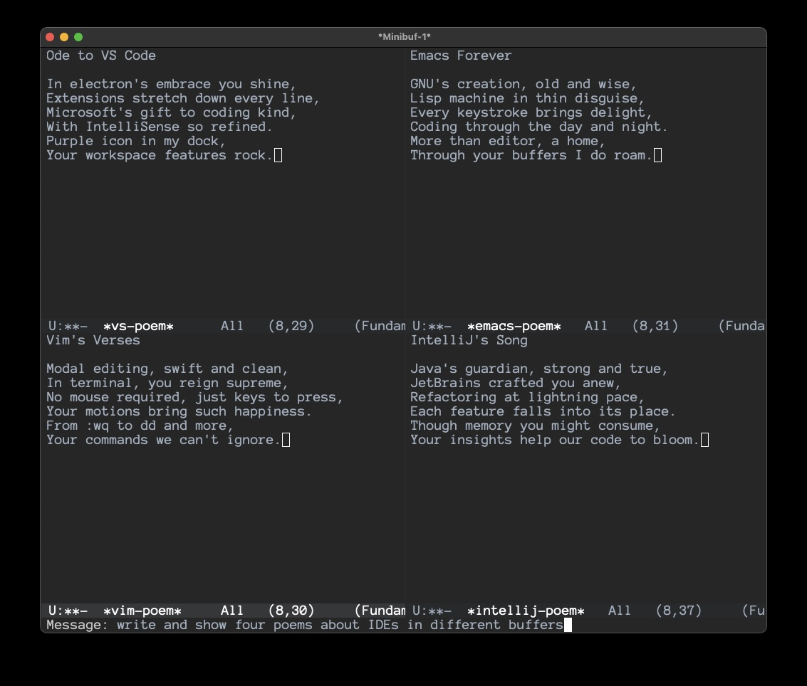

# Efrit - AI-Powered Autonomous Emacs Assistant

*A sophisticated AI coding agent that enables autonomous development through direct Elisp evaluation and agent-to-agent communication.*

## 🚀 What's New: Agent-to-Agent Architecture

**Efrit is evolving into a platform for autonomous AI development**:

- **🤖 Agent Communication Channel**: File-based queue system enables any AI coding agent (Claude Code, GitHub Copilot, Sourcegraph Amp, etc.) to interact directly with Efrit
- **🔧 Self-Enhancing Capabilities**: AI agents can debug, test, and enhance Efrit's own functionality autonomously  
- **⚡ Autonomous Development Mode**: Spawn independent Emacs instances for hours-long AI development sessions
- **💬 Multi-Modal Interface**: Chat, command, and agent modes for different interaction styles

*This positions Efrit as both a powerful user assistant AND a platform for AI-driven development.*

---

## Overview

Efrit provides multiple interfaces for AI-powered Emacs development:

- **efrit-chat** - Multi-turn conversational interface for complex discussions  
- **efrit-do** - Natural language command execution for quick tasks
- **efrit-remote-queue** - 🆕 File-based channel for AI agent communication
- **efrit-agent-run** - Advanced autonomous agent loop

## Key Features

### Core Capabilities
- **Direct Elisp Evaluation**: Full access to Emacs' native programmability
- **Multi-turn Conversations**: Maintains context across exchanges
- **Tool Integration**: Manipulate buffers, execute functions, interact with environment
- **Safety-First Design**: Comprehensive error handling and confirmation systems

### 🆕 Agent-to-Agent Features
- **Remote Queue System**: AI agents communicate via JSON file exchange
- **Autonomous Operation**: AI can spawn and control its own Emacs instances  
- **Self-Enhancement**: Agents can modify and improve Efrit's source code
- **Multi-Agent Support**: Designed for any AI coding agent, not just one client

## Installation

### Prerequisites

- **Emacs**: Version 28.1 or later
- **Anthropic API Key**: Get yours from [Anthropic Console](https://console.anthropic.com/)
- **Internet Connection**: Required for Claude API access

### Quick Installation

1. **Clone the repository**:
   ```bash
   git clone https://github.com/steveyegge/efrit.git
   cd efrit
   ```

2. **Add to your Emacs configuration** (`~/.emacs.d/init.el`):
   ```elisp
   (add-to-list 'load-path "/path/to/efrit/lisp")
   (require 'efrit)
   ```

3. **Configure your API key** in `~/.authinfo`:
   ```
   machine api.anthropic.com login personal password YOUR_API_KEY_HERE
   ```

4. **Restart Emacs** and test with `M-x efrit-chat`

### Data Directory

Efrit stores all user data (sessions, context, queues, logs) in `~/.emacs.d/.efrit/`:

```
~/.emacs.d/.efrit/
├── cache/          # Temporary cache files
├── context/        # Context persistence (efrit-do)
├── queues/         # AI-to-efrit communication
├── logs/           # Debug and activity logs
├── sessions/       # Session data
└── workspace/      # Autonomous workspace files
```

**Customization**: Configure location via `efrit-data-directory` variable:
```elisp
(setq efrit-data-directory "~/my-custom-efrit-data")
```

**Migration**: Existing efrit files are automatically migrated to the new structure.

### 🆕 Enable Agent Communication

Start the remote queue to allow AI agents to interact with Efrit:

```elisp
;; In Emacs
(efrit-remote-queue-start)  ; or C-c C-e q
```

This creates `~/.emacs.d/.efrit/queues/` for AI agent communication.

## Usage

### Interactive Usage (Human → Efrit)

```elisp
M-x efrit-chat          ; Conversational interface
M-x efrit-do           ; Natural language commands  
M-x efrit-streamlined-send  ; Streamlined chat mode
```

**Key Bindings**: `C-c C-e` + `c`/`d`/`s`/`a`/`q`

### Example: Creative Content Generation

Here's efrit creating four different poems about IDEs in separate buffers with a single request:



This demonstrates efrit's ability to handle complex, multi-part requests through natural language commands.

### 🆕 Agent Communication (AI → Efrit)

AI agents write JSON requests to the queue directory:

```json
{
  "id": "req_001",
  "type": "eval", 
  "content": "(+ 40 2)"
}
```

Efrit processes and responds with JSON results:

```json
{
  "id": "req_001",
  "status": "success",
  "result": "42"
}
```

See [`QUEUE_USAGE_EXAMPLE.md`](QUEUE_USAGE_EXAMPLE.md) for detailed integration examples.

### Examples

**Human Interaction**:
```
M-x efrit-do
> write an ode in one buffer, and a sonnet in another, both about Vim
```

**AI Agent Interaction**:
```python
# Any AI agent can now interact with Efrit
efrit = EfritQueue()
result = efrit.send_request("command", "split window and open dired")
print(f"✓ {result['status']}")
```

## Architecture

### Core Philosophy

**Efrit is becoming a platform for autonomous AI development**:

1. **Human-Friendly**: Rich interactive interfaces for users
2. **Agent-Friendly**: File-based communication channel for AI systems
3. **Self-Enhancing**: AI agents can improve Efrit's own capabilities
4. **Zero Client Intelligence**: All AI processing happens in Claude, Efrit is pure executor

### Core Components

- **efrit.el** - Main entry point and coordination
- **efrit-chat.el** - Conversational interfaces  
- **efrit-do.el** - Natural language command execution
- **efrit-remote-queue.el** - 🆕 Agent communication system
- **efrit-tools.el** - Core Elisp evaluation engine
- **efrit-agent.el** - Autonomous agent capabilities

## 🛣️ Roadmap

### Current Development
- ✅ **File-based Agent Communication** - Complete
- ✅ **Autonomous AI Development Environment** - Complete
- 🔄 **Self-Enhancement Capabilities** - Next Phase  

### Vision
Transform Efrit from a user assistant into an **autonomous AI development platform** where:
- AI agents enhance Efrit's functionality independently
- Multiple AI systems can collaborate through Efrit
- Users benefit from continuously improving capabilities

## Configuration

```elisp
;; Standard Efrit settings
(setq efrit-model "claude-3-5-sonnet-20241022")
(setq efrit-max-tokens 8192)

;; 🆕 Agent communication settings  
(setq efrit-remote-queue-directory "~/.emacs.d/efrit-queue")
(setq efrit-remote-queue-max-concurrent 10)

;; Start agent communication on load (optional)
(add-hook 'after-init-hook #'efrit-remote-queue-start)
```

## Development

### For AI Agents
See [`AUTONOMOUS_AI_PLAN.md`](AUTONOMOUS_AI_PLAN.md) for autonomous development architecture.

### For Contributors
```bash
make compile  # Build
make test     # Run tests
```

See [CONTRIBUTING.md](CONTRIBUTING.md) for detailed guidelines.

## License

Licensed under the Apache License, Version 2.0. See [LICENSE](LICENSE) for details.

---

*Efrit: Autonomous AI development meets the power of Emacs.*
